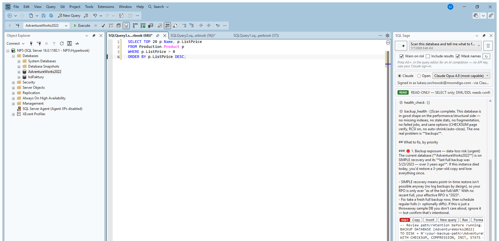

# SQL Sage

**AI pair-DBA for SSMS 22 that proves & logs what it changes — keyless, running on your own Claude / ChatGPT / Codex.**

SQL Sage is an English-language extension you install inside **SQL Server Management Studio 22** on Windows (a VSIX add-in). It brings an AI pair-DBA into the query editor: it explains errors, tunes slow T-SQL, and runs SQL safely — signed in with your own **Claude** (Claude Code) or **ChatGPT / OpenAI Codex** account, so there is **no API key** and no second, metered AI bill. It runs as part of SSMS on your machine; it is **not** a web app or an online SQL editor.

It is an independent extension built by **Luma (LUMA sp. z o.o.)** and is **not affiliated with Microsoft, Anthropic or OpenAI**.

## Why it's different — Copilot guesses, SQL Sage proves it

Most AI in SSMS predicts an answer from the model. SQL Sage reads the actual server through DMVs and system catalogs, then **proves and logs** what it did. Four deterministic surfaces make it a real SQL Server AI assistant rather than a chat box:

- **Change-Impact** — before any `ALTER` / `DROP`, see exactly what breaks: dependent views, stored procedures and triggers, inbound foreign keys, and the rows at risk. The blast radius, computed — not guessed.
- **Incident Mode** — one-click live triage of a struggling server: the blocking chain, top waits, and the most expensive queries, with **every claim cited to a real number** from a DMV.
- **Prove-It** — proves that an AI rewrite of a query returns the **same rows** as the original, using a deterministic multiset fingerprint. Zero AI tokens spent — it's pure computation, not a second opinion from the model.
- **Tamper-evident audit** — a running, tamper-evident log of what the AI touched, with an evidence export you can hand to a reviewer or attach to a change ticket.

## Keyless — bring your own AI account

SQL Sage does not resell tokens and never sees your AI bill. Sign in with an account you already have:

- **Claude in SSMS** via the Claude Code CLI, or
- **ChatGPT / OpenAI Codex in SSMS** via the Codex CLI.

Pick the provider and model in the panel. No API key to paste, no per-token charge from us — a genuinely **keyless GitHub Copilot in SSMS alternative**.

New models appear on their own: the model list is read live from your Claude Code installation, so a new Claude model shows up without waiting for a SQL Sage release. You also choose **how hard the AI thinks** — a reasoning-effort selector next to the model picker offers exactly the levels your model supports (for example Low → High → Max), and `/effort high` raises it for a single answer. "Auto" keeps the fast default; higher effort is slower and uses more of your plan's limits.

## Safe by default

A ScriptDom gate classifies every statement before it runs:

- **`SELECT` runs automatically** so exploration stays fast.
- **DML / DDL stops for explicit confirmation**, with the exact SQL shown in front of you before anything executes.
- Queries that reach **beyond the current database** — linked servers, `OPENQUERY`, `OPENROWSET` (including `BULK` file reads), `OPENDATASOURCE` — always stop for confirmation, even when they look like a plain `SELECT`.
- SQL Sage reads **schema and DMVs**; it **never sends your query results to the model** without an explicit per-session opt-in — and results you shared with one AI provider are **not re-sent to another** if you switch, unless you agree again.
- **Run** executes only in the new query window SQL Sage opened, after checking the SQL, server and database match; every step (approved → dispatched → done or failed) lands in the audit log.
- Chat history is **encrypted on disk** (Windows DPAPI) with a retention setting, or you can turn saving off.

## Editions & platforms

Edition-aware across **box SQL Server**, **Azure SQL Database**, and **Azure SQL Managed Instance** — it uses what each platform exposes and degrades gracefully where a feature doesn't exist (for example, features that depend on server-level DMVs unavailable on Azure SQL Database).

| | |
| --- | --- |
| Host | SQL Server Management Studio 22 |
| OS | Windows · x64 / Arm64 |
| Targets | SQL Server (box), Azure SQL Database, Azure SQL Managed Instance |
| AI providers | Your own Claude (Claude Code) or ChatGPT / OpenAI Codex (Codex CLI) |

## Install

1. Download the signed installer from the [**latest release**](https://github.com/LUMASoftPL/sqlsage/releases/latest) (currently **0.22.0**) or from **[sqlsage.lumasoft.pl](https://sqlsage.lumasoft.pl/?src=github)**.
2. Run it. **SSMS 22 is required.** When upgrading, close SSMS first.
3. Open SSMS, connect to a server, and open the SQL Sage panel.

The installer is Authenticode-signed by **LUMA sp. z o.o.** (Certum) — since 0.21.0 end to end, including the setup stage it extracts to `%TEMP%` and the uninstaller, so it also runs on PCs with Smart App Control or App Control for Business. Because this is a newer publisher whose download reputation is still building, Windows SmartScreen may show **"Windows protected your PC"** — choose **More info → Run anyway**. For extra assurance, verify the **SHA-256** hash published on the website and in the release notes against your downloaded file before installing.

## Pricing

- **30-day free trial** — all features, **no credit card**.
- After the trial, SQL Sage keeps working as **SQL Sage Free** (below); AI features and the Proven & Accountable layer need a paid license. Because SQL Sage is **keyless**, you bring your own AI account and there is no metered AI charge on top.
- Current pricing (see the site for details): own it once from **$39**, or subscribe from **$29/year**.

Full, up-to-date pricing: **[sqlsage.lumasoft.pl](https://sqlsage.lumasoft.pl/?src=github)**

### Free after the trial

Every install starts with a 30-day free trial of everything. After it, SQL Sage keeps working as
**SQL Sage Free** — the editor tools below, with zero AI (LLM) calls. AI features and the Proven &
Accountable layer need a license.

- **Free:** F5 execution warnings, JOIN…ON suggestions from foreign keys, Format SQL (uses SSMS's own
  formatter when available), Expand `SELECT *`, Qualify object names, Execute current statement.
  Redgate-style shortcuts (Ctrl+B, Ctrl+W · Ctrl+B, Ctrl+Q · Ctrl+K, Ctrl+Y · Shift+F5) step aside
  automatically when SQL Prompt is installed.
- **With a license:** AI chat, Explain / Fix / Optimize / Document, AI completions (Alt+.), and the
  Proven & Accountable layer — Change-Impact, Incident Mode, Prove-It.

Questions about Free: [GitHub Discussions](https://github.com/LUMASoftPL/sqlsage/discussions) (community, no SLA).

## Links

- **Website:** [sqlsage.lumasoft.pl](https://sqlsage.lumasoft.pl/?src=github)
- **Latest release:** https://github.com/LUMASoftPL/sqlsage/releases/latest
- **Discussions (Q&A):** https://github.com/LUMASoftPL/sqlsage/discussions
- **Issues & feature requests:** https://github.com/LUMASoftPL/sqlsage/issues
- **Email:** support@lumasoft.pl

---

SQL Sage is **commercial / proprietary software** — © LUMA sp. z o.o. This repository hosts releases, documentation and issue tracking; the product source is not open-source. Not affiliated with Microsoft, Anthropic or OpenAI.
